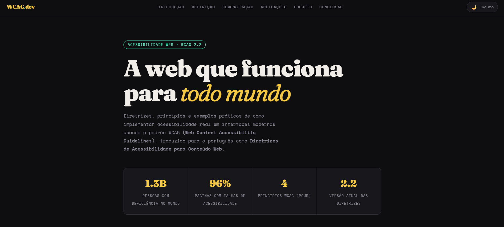
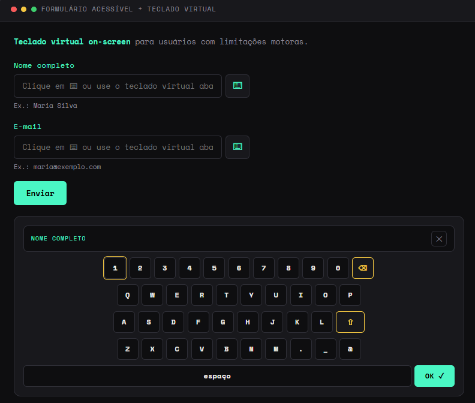
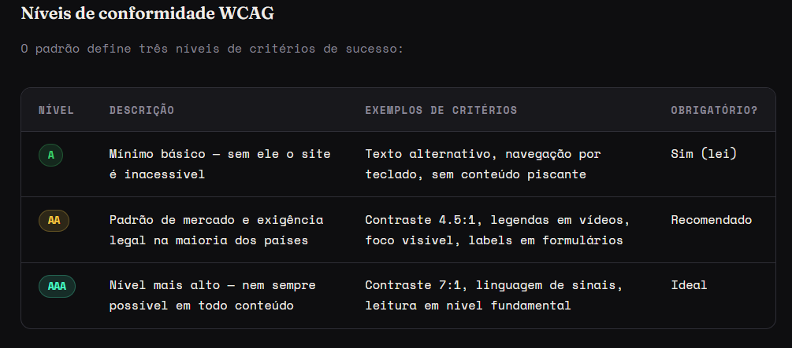

# WCAG e Acessibilidade Web na Prática

## 📖 Descrição do Objetivo

Este projeto foi desenvolvido com o objetivo de demonstrar, na prática, a aplicação das diretrizes WCAG (Web Content Accessibility Guidelines), traduzidas para o português como Diretrizes de Acessibilidade para Conteúdo Web.

O projeto apresenta conceitos fundamentais de acessibilidade digital e implementa recursos que tornam a navegação mais inclusiva para pessoas com deficiência visual, motora e cognitiva.

---

## 🛠 Softwares Utilizados

Para o desenvolvimento deste projeto foram utilizados os seguintes softwares:

- Visual Studio Code
- Google Chrome
- Git
- GitHub
- Netlify (Deploy)

---

## 📥 Instalação

### 1. Clonar o repositório

```bash
git clone https://github.com/gps47/Seminario---WCAG.git
```

### 2. Acessar a pasta do projeto

```bash
cd Seminario---WCAG
```

### 3. Abrir o projeto

Abra o arquivo `index.html` em qualquer navegador moderno.

---

## 🚀 Passo a Passo do Desenvolvimento

### Etapa 1 – Pesquisa sobre WCAG

Inicialmente foi realizada uma pesquisa sobre as diretrizes WCAG, seus princípios e níveis de conformidade (A, AA e AAA).

---

### Etapa 2 – Estruturação da Página

Foi criado um documento HTML utilizando elementos semânticos para melhorar a acessibilidade e a organização do conteúdo.

Exemplos utilizados:

- `<header>`
- `<nav>`
- `<main>`
- `<section>`
- `<footer>`

---

### Etapa 3 – Aplicação de Recursos de Acessibilidade

Foram implementados diversos recursos recomendados pelo WCAG:

- Skip Link
- Navegação por teclado
- Contraste adequado
- Estrutura correta de títulos
- Formulários acessíveis
- Uso de atributos ARIA
- Foco visível para elementos interativos

---

### Etapa 4 – Estilização da Interface

Foi utilizado HTML e CSS para criar uma interface moderna, responsiva e com bom contraste visual.

---

### Etapa 5 – Testes

Foram realizados testes de navegação por teclado para verificar a acessibilidade dos componentes implementados.

---

## 📊 Resultados Obtidos

O projeto permitiu demonstrar na prática diversos conceitos de acessibilidade web, incluindo:

- Navegação acessível por teclado;
- Estrutura semântica adequada;
- Melhor compatibilidade com leitores de tela;
- Melhor experiência para diferentes perfis de usuários;
- Aplicação prática dos princípios do WCAG.

---

## 📸 Imagens do Projeto

### Página Inicial



### Exemplo do Teclado Virtual



### Exemplo de WCAG


---

## 🌐 Deploy pelo vercel

https://semin-rio-wcag-final.vercel.app/

---

## 📂 Repositório

GitHub:

https://github.com/gps47/Semin-rio-WCAG-Final

---

## 👨‍🎓 Autores

Projeto desenvolvido por: Antony, Cristyan e Gabriel
